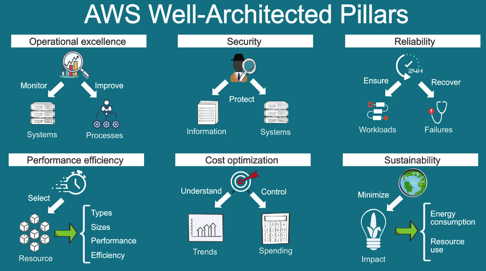

# Prepare for the Cloud Practitioner Exam

## [X] [LinkedIn Learning Course](https://www.linkedin.com/learning/aws-certified-cloud-practitioner-clf-c01-cert-prep-1-cloud-concepts)
## [ ] [AWS Certification Prep Guide](https://aws.amazon.com/certification/certified-cloud-practitioner/?ch=sec&sec=rmg&d=1)
  - ### [X] Exam Prep Official Question Set: AWS Certified Cloud Practitioner
  - ### [X] AWS Cloud Practitioner Essentials
  - ### [X] AWS Cloud Quest: Cloud Practitioner
  - ### [X] Exam Prep Standard Course: AWS Certified Cloud Practitioner
  - ### [X] Exam Prep Official Pretest: AWS Certified Cloud Practitioner
  - ### [X] AWS Technical Essentials (Modules 1, 2, 3, 5, and 6)
  - ### [X] Exam Prep Enhanced Course: AWS Certified Cloud Practitioner
  - ### [ ] AWS Escape Room: Exam Prep for AWS Certified Cloud Practitioner
  - ### [ ] Exam Prep Official Practice Exam: AWS Certified Cloud Practitioner

## Links
- [AWS Well-Architected Framework Whitepaper](https://docs.aws.amazon.com/wellarchitected/latest/framework/welcome.html)
- [Overview of Amazon Web Services Whitepaper](https://docs.aws.amazon.com/whitepapers/latest/aws-overview/introduction.html)
- [AWS Global Infrastructure](https://aws.amazon.com/about-aws/global-infrastructure/)
- [How AWS WAF works](https://docs.aws.amazon.com/waf/latest/developerguide/how-aws-waf-works.html)
- [AWS Customer Compliance Center](https://aws.amazon.com/compliance/customer-center/)
- [Compute services](https://docs.aws.amazon.com/whitepapers/latest/aws-overview/compute-services.html)
- [Database services](https://docs.aws.amazon.com/whitepapers/latest/aws-overview/database.html)
- [Networking and content delivery services](https://docs.aws.amazon.com/whitepapers/latest/aws-overview/networking-services.html)
- [Storage services](https://docs.aws.amazon.com/whitepapers/latest/aws-overview/storage-services.html)
- [Analytics services](https://docs.aws.amazon.com/whitepapers/latest/aws-overview/analytics.html)
- [Machine Learning Concepts](https://docs.aws.amazon.com/machine-learning/latest/dg/machine-learning-concepts.html)

## Top Notes
- 4 domains
  - Cloud Concepts
    - 24% of the exam contents
    - Define the AWS Cloud and its value proposition
    - Identify aspects of AWS Cloud economics
    - Describe the different cloud architecture design principles
  - Security
    - 30% of the exam
    - Define the AWS shared responsibility model
    - Define AWS Cloud security and compliance concepts
    - Identify AWS access management capabilities
    - Identify resources for security support
  - Technology
    - 34% of the exam
    - Define methods of deploying and operating in the AWS Cloud
    - Define the AWS global infrastructure
    - Identify the core AWS services
    - Identify resources for technology support
  - Billing, Pricing and Support
    - 12% of the exam
    - Compare and contrast the various pricing models for AWS
    - Recognize the various account structures in relation to AWS billing and pricing
    - Identify resources available for billing support
- Very broad understanding of services and applications
- Changes between CLF-01 vs CLF-02
  - Domain names and percentages
  - Migration and business application have been added into the exam content
  - Increase in breadth, but not as much depth
  - Domain 1: AWS Cloud Adoption Framework
  - Domain 3: AI, ML and data analytics services

## Core Services Cheat Sheet:
### Compute
- EC2: Virtual Server
- Elastic Beanstalk: Automatically "grows" your application
- Elastic Load Balancing: Balances incoming traffic loads
- Lambda: Runs serverless code
- Lightsail: Pre-configured virtual servers
### Storage
- S3: Object storage
- Elastic Block Store: Block storage for EC2
- Snowball: Data migration tool (huge amount with physical device)
- Storage Gateway: Connects on-premises software appliance with cloud-based storage
### Database
- DynamoDb: NoSQL database
- RDS: Relational Database that supports six types of database engines
- Aurora: Relational Database running on TDS
- Redshift: Data warehouse for huge amounts of data
### Network and Content Delivery
- VPC: Virtual Private Cloud
- CloudFront: Caches content to edge locations to load faster
- Route 53: Routes domains to services and IP addresses
### Management Tools
- CloudFormation: Form resources with templates
- CloudTrail: Tracks "trails" of action (audit logs)
- CloudWatch: Watches for issues - and can automatically act on triggers

- Amazon Polly: machine learning service that converts text to speech
- CodeCommit: Source control service
- sSite-to-Site VPN: Connects on-premises network to AWS
- Amazon Application Migration Service: an automated lift-and-shift solution. This solution can migrate physical servers and any databases or applications that run on them to EC2 instances in AWS.
- DocumentDB: Document database service that supports MongoDb
- AWS Neptune: Graph database service (recommendations, fraud detection, social networking)
- AWS Quantum Ledger Database: Fully managed ledger database that provides a transparent, immutable, and cryptographically verifiable transaction log
- AWS Managed Blockchain: service that you can use to create and manage blockchain networks with open-source frameworks.
- AWS ElastiCache: adds caching layers on top of your databases to help improve the read times of common requests.
- DynamoDB Accelerator: In-memory cache for DynamoDB

